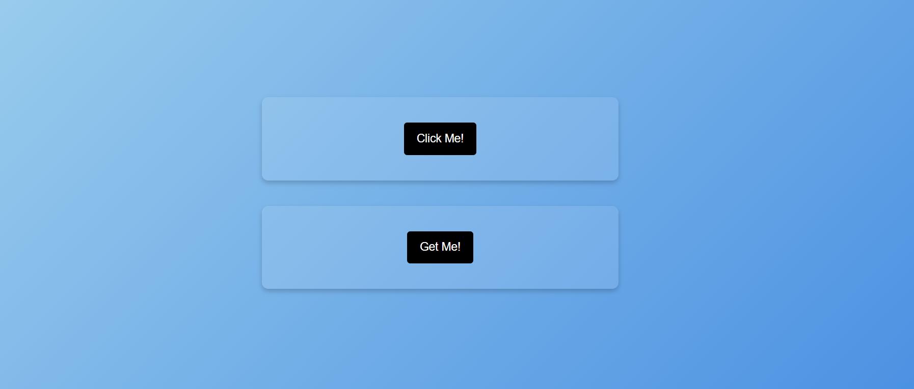

# ClickMeApi

ClickMeApi is a backend API built with ASP.NET Core and MongoDB. It allows you to create and retrieve user actions, such as button clicks, and stores them in a MongoDB database.

Snapshots of application:

